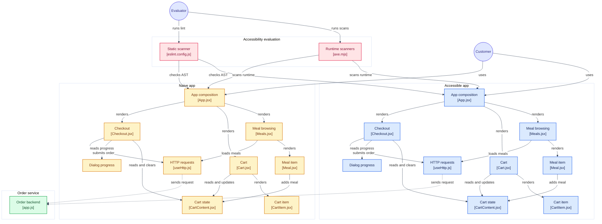

```mermaid
  %%{init: {'theme': 'base', 'themeVariables': {'darkMode': false, 'background': '#ffffff', 'mainBkg': '#ffffff', 'secondBkg': '#ffffff', 'clusterBkg': '#ffffff', 'edgeLabelBackground': '#ffffff', 'lineColor': '#334155'}, 'themeCSS': 'svg { background-color: #ffffff !important; } .background, svg > rect.background { fill: #ffffff !important; }'}}%%
  flowchart TD

  subgraph group_accessible["Accessible app"]
    node_a_app["App composition<br/>[App.jsx]"]
    node_a_meals["Meal browsing<br/>[Meals.jsx]"]
    node_a_meal["Meal item<br/>[Meal.jsx]"]
    node_a_cart["Cart<br/>[Cart.jsx]"]
    node_a_cartitem["Cart item<br/>[CartItem.jsx]"]
    node_a_checkout["Checkout<br/>[Checkout.jsx]"]
    node_a_state["Cart state<br/>[CartContent.jsx]"]
    node_a_progress["Dialog progress"]
    node_a_http["HTTP requests<br/>[useHttp.js]"]
  end

  subgraph group_naive["Naive app"]
    node_n_app["App composition<br/>[App.jsx]"]
    node_n_meals["Meal browsing<br/>[Meals.jsx]"]
    node_n_meal["Meal item<br/>[Meal.jsx]"]
    node_n_cart["Cart<br/>[Cart.jsx]"]
    node_n_cartitem["Cart item<br/>[CartItem.jsx]"]
    node_n_checkout["Checkout<br/>[Checkout.jsx]"]
    node_n_state["Cart state<br/>[CartContent.jsx]"]
    node_n_progress["Dialog progress"]
    node_n_http["HTTP requests<br/>[useHttp.js]"]
  end

  subgraph group_services["Order service"]
    node_backend["Order backend<br/>[app.js]"]
  end

  subgraph group_evaluation["Accessibility evaluation"]
    node_scanner["Runtime scanners<br/>[axe.mjs]"]
    node_static_scan["Static scanner<br/>[eslint.config.js]"]
  end

  node_user(("Customer"))
  node_evaluator(("Evaluator"))

  node_user -->|"uses"| node_a_app
  node_a_app -->|"renders"| node_a_meals
  node_a_app -->|"renders"| node_a_cart
  node_a_app -->|"renders"| node_a_checkout
  node_a_meals -->|"renders"| node_a_meal
  node_a_meals -->|"loads meals"| node_a_http
  node_a_meal -->|"adds meal"| node_a_state
  node_a_cart -->|"renders"| node_a_cartitem
  node_a_cart -->|"reads and updates"| node_a_state
  node_a_checkout -->|"reads and clears"| node_a_state
  node_a_checkout -->|"reads progress"| node_a_progress
  node_a_checkout -->|"submits order"| node_a_http
  node_a_http -.->|"sends request"| node_backend
  node_user -->|"uses"| node_n_app
  node_n_app -->|"renders"| node_n_meals
  node_n_app -->|"renders"| node_n_cart
  node_n_app -->|"renders"| node_n_checkout
  node_n_meals -->|"renders"| node_n_meal
  node_n_meals -->|"loads meals"| node_n_http
  node_n_meal -->|"adds meal"| node_n_state
  node_n_cart -->|"renders"| node_n_cartitem
  node_n_cart -->|"reads and updates"| node_n_state
  node_n_checkout -->|"reads and clears"| node_n_state
  node_n_checkout -->|"reads progress"| node_n_progress
  node_n_checkout -->|"submits order"| node_n_http
  node_n_http -.->|"sends request"| node_backend
  node_evaluator -->|"runs scans"| node_scanner
  node_evaluator -->|"runs lint"| node_static_scan
  node_scanner -->|"scans runtime"| node_a_app
  node_scanner -->|"scans runtime"| node_n_app
  node_static_scan -->|"checks AST"| node_a_app
  node_static_scan -->|"checks AST"| node_n_app

  

  classDef toneNeutral fill:#f8fafc,stroke:#334155,stroke-width:1.5px,color:#0f172a
  classDef toneBlue fill:#dbeafe,stroke:#2563eb,stroke-width:1.5px,color:#172554
  classDef toneAmber fill:#fef3c7,stroke:#d97706,stroke-width:1.5px,color:#78350f
  classDef toneMint fill:#dcfce7,stroke:#16a34a,stroke-width:1.5px,color:#14532d
  classDef toneRose fill:#ffe4e6,stroke:#e11d48,stroke-width:1.5px,color:#881337
  classDef toneIndigo fill:#e0e7ff,stroke:#4f46e5,stroke-width:1.5px,color:#312e81
  classDef toneTeal fill:#ccfbf1,stroke:#0f766e,stroke-width:1.5px,color:#134e4a
  class node_a_app,node_a_meals,node_a_meal,node_a_cart,node_a_cartitem,node_a_checkout,node_a_state,node_a_progress,node_a_http toneBlue
  class node_n_app,node_n_meals,node_n_meal,node_n_cart,node_n_cartitem,node_n_checkout,node_n_state,node_n_progress,node_n_http toneAmber
  class node_backend toneMint
  class node_scanner,node_static_scan toneRose
  class node_user,node_evaluator toneIndigo
```