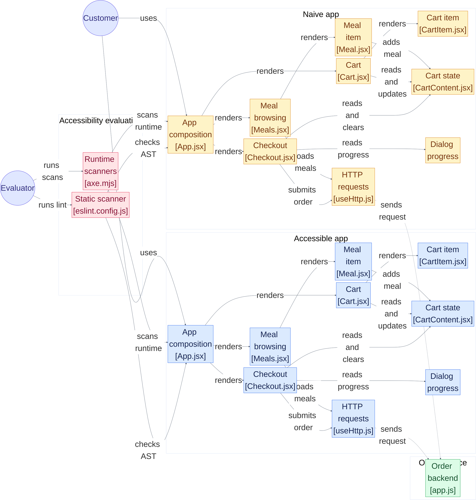

```mermaid
---
config:
  theme: base
  themeVariables:
    fontSize: 50px
    fontFamily: ''
    darkMode: false
    background: '#ffffff'
    mainBkg: '#ffffff'
    secondBkg: '#ffffff'
    clusterBkg: '#ffffff'
    edgeLabelBackground: '#ffffff'
    lineColor: '#334155'
  flowchart:
    useMaxWidth: false
    htmlLabels: true
    nodeSpacing: 14
    rankSpacing: 20
    padding: 4
    diagramPadding: 2
---
flowchart LR
 subgraph group_accessible["Accessible app"]
        node_a_app["App composition<br>[App.jsx]"]
        node_a_meals["Meal browsing<br>[Meals.jsx]"]
        node_a_meal["Meal item<br>[Meal.jsx]"]
        node_a_cart["Cart<br>[Cart.jsx]"]
        node_a_cartitem["Cart item<br>[CartItem.jsx]"]
        node_a_checkout["Checkout<br>[Checkout.jsx]"]
        node_a_state["Cart state<br>[CartContent.jsx]"]
        node_a_progress["Dialog progress"]
        node_a_http["HTTP requests<br>[useHttp.js]"]
  end
 subgraph group_naive["Naive app"]
        node_n_app["App composition<br>[App.jsx]"]
        node_n_meals["Meal browsing<br>[Meals.jsx]"]
        node_n_meal["Meal item<br>[Meal.jsx]"]
        node_n_cart["Cart<br>[Cart.jsx]"]
        node_n_cartitem["Cart item<br>[CartItem.jsx]"]
        node_n_checkout["Checkout<br>[Checkout.jsx]"]
        node_n_state["Cart state<br>[CartContent.jsx]"]
        node_n_progress["Dialog progress"]
        node_n_http["HTTP requests<br>[useHttp.js]"]
  end
 subgraph group_services["Order service"]
        node_backend["Order backend<br>[app.js]"]
  end
 subgraph group_evaluation["Accessibility evaluation"]
        node_scanner["Runtime scanners<br>[axe.mjs]"]
        node_static_scan["Static scanner<br>[eslint.config.js]"]
  end
    node_user(("Customer")) -- uses --> node_a_app & node_n_app
    node_a_app -- renders --> node_a_meals & node_a_cart & node_a_checkout
    node_a_meals -- renders --> node_a_meal
    node_a_meals -- loads meals --> node_a_http
    node_a_meal -- adds meal --> node_a_state
    node_a_cart -- renders --> node_a_cartitem
    node_a_cart -- reads and updates --> node_a_state
    node_a_checkout -- reads and clears --> node_a_state
    node_a_checkout -- reads progress --> node_a_progress
    node_a_checkout -- submits order --> node_a_http
    node_a_http ~~~ node_a_progress
    node_a_http -. sends request .-> node_backend
    node_n_app -- renders --> node_n_meals & node_n_cart & node_n_checkout
    node_n_meals -- renders --> node_n_meal
    node_n_meals -- loads meals --> node_n_http
    node_n_meal -- adds meal --> node_n_state
    node_n_cart -- renders --> node_n_cartitem
    node_n_cart -- reads and updates --> node_n_state
    node_n_checkout -- reads and clears --> node_n_state
    node_n_checkout -- reads progress --> node_n_progress
    node_n_checkout -- submits order --> node_n_http
    node_n_http ~~~ node_n_progress
    node_n_http -. sends request .-> node_backend
    node_evaluator(("Evaluator")) -- runs scans --> node_scanner
    node_evaluator -- runs lint --> node_static_scan
    node_scanner -- scans runtime --> node_a_app & node_n_app
    node_static_scan -- checks AST --> node_a_app & node_n_app

     node_a_app:::toneBlue
     node_a_meals:::toneBlue
     node_a_meal:::toneBlue
     node_a_cart:::toneBlue
     node_a_cartitem:::toneBlue
     node_a_checkout:::toneBlue
     node_a_state:::toneBlue
     node_a_progress:::toneBlue
     node_a_http:::toneBlue
     node_n_app:::toneAmber
     node_n_meals:::toneAmber
     node_n_meal:::toneAmber
     node_n_cart:::toneAmber
     node_n_cartitem:::toneAmber
     node_n_checkout:::toneAmber
     node_n_state:::toneAmber
     node_n_progress:::toneAmber
     node_n_http:::toneAmber
     node_backend:::toneMint
     node_scanner:::toneRose
     node_static_scan:::toneRose
     node_user:::toneIndigo
     node_evaluator:::toneIndigo
    classDef toneNeutral fill:#f8fafc,stroke:#334155,stroke-width:1.5px,color:#0f172a
    classDef toneBlue fill:#dbeafe,stroke:#2563eb,stroke-width:1.5px,color:#172554
    classDef toneAmber fill:#fef3c7,stroke:#d97706,stroke-width:1.5px,color:#78350f
    classDef toneMint fill:#dcfce7,stroke:#16a34a,stroke-width:1.5px,color:#14532d
    classDef toneRose fill:#ffe4e6,stroke:#e11d48,stroke-width:1.5px,color:#881337
    classDef toneIndigo fill:#e0e7ff,stroke:#4f46e5,stroke-width:1.5px,color:#312e81
    classDef toneTeal fill:#ccfbf1,stroke:#0f766e,stroke-width:1.5px,color:#134e4a
```